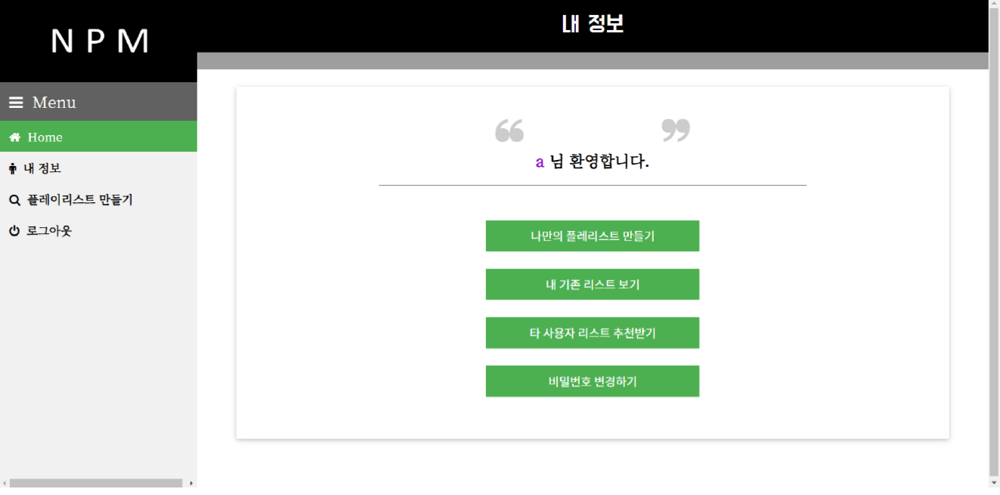
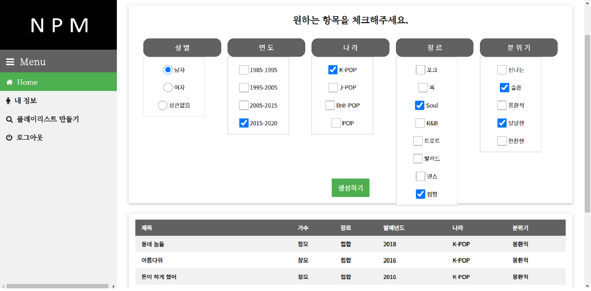
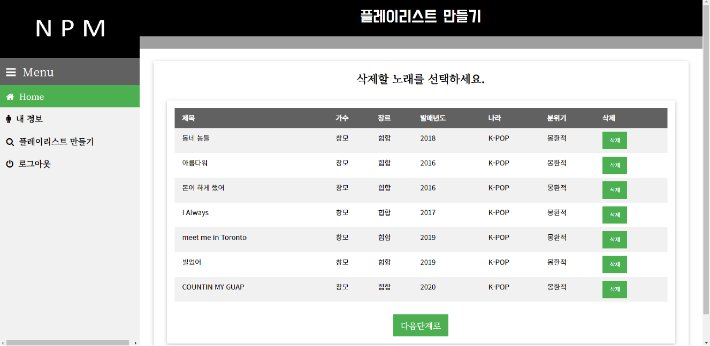
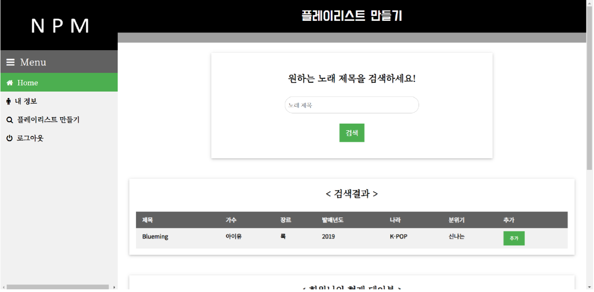
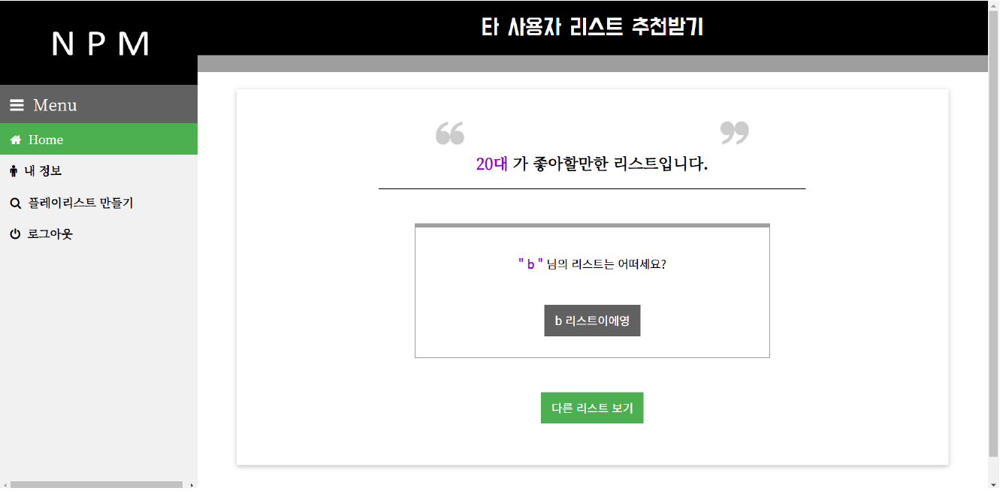
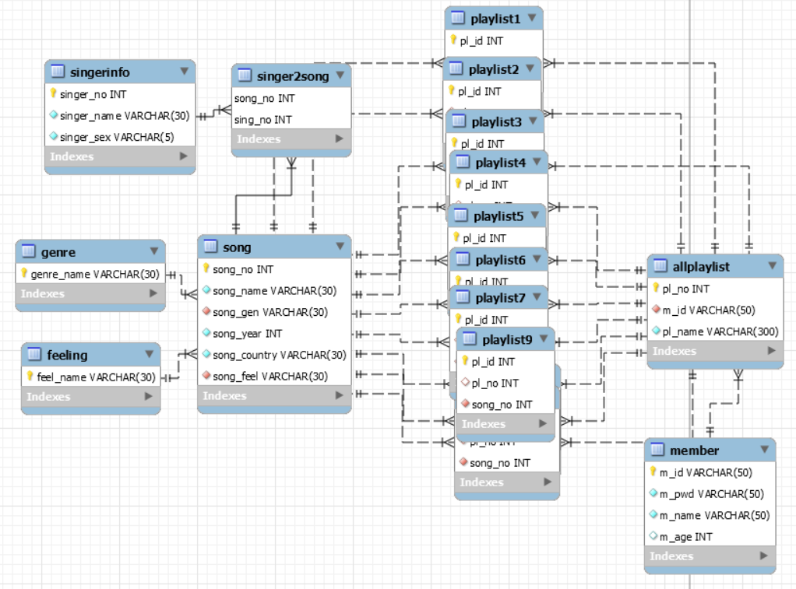
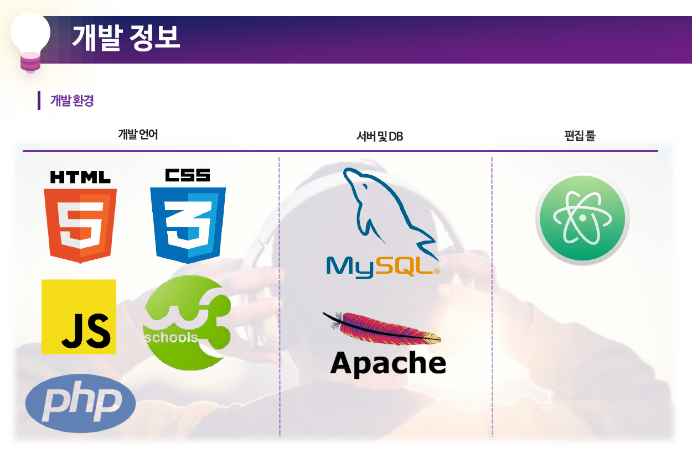

# < 데이터베이스 프로젝트 >

### 나만의 플레이리스트를 생성할 수 있는 웹사이트 'NPM'

 

## 팀원

|이름|기여|
|:--:|:--:|
|[김지수](https://github.com/ghis22130)|📂 Backend, DB|
|[한재원](https://github.com/hanjo8813)|📄 Frontend, DB|

 

## 사이트 소개

1. 나만의 플레이리스트 만들기(NPM)는 데이터베이스 프로젝트입니다.
2. NPM은 사용자가 다양한 카테고리를 선택하여 음악 플레이리스트를 커스텀할 수 있게 도와주는 사이트입니다.
3. 기본적인 로그인/회원가입 기능을 제공합니다.
4. 1차로 카테고리 복수 선택을 통해 플레이리스트를 생성합니다.
5. 2차로 생성된 플레이리스트에서 노래를 삭제합니다.
6. 3차로 해당 플레이리스트에 노래를 검색해 추가합니다.
7. 마지막으로 플레이리스트의 이름을 지정합니다.
8. 사용자는 마이페이지에서 자신이 생성한 플레이리스트를 관리할 수 있습니다.
9. 추가 기능으로 타 사용자(비슷한 연령대)의 리스트 추천과 비밀번호 변경 등을 제공합니다.

 

## 주요 기능

||
|:--:|
|**1) 마이페이지**|
 

||
|:--:|
|**2) 카테고리 복수선택**|
 

||
|:--:|
|**3) 플레이리스트 커스텀(삭제)**|
 

||
|:--:|
|**4) 플레이리스트 커스텀(검색/추가)**|
 

||
|:--:|
|**5) 타 사용자 플레이리스트 추천**|
 

## Diagram

> ### Schema Diagram
 

 

> ### System Flow-chart (Demo)
 

## 개발 정보

 

